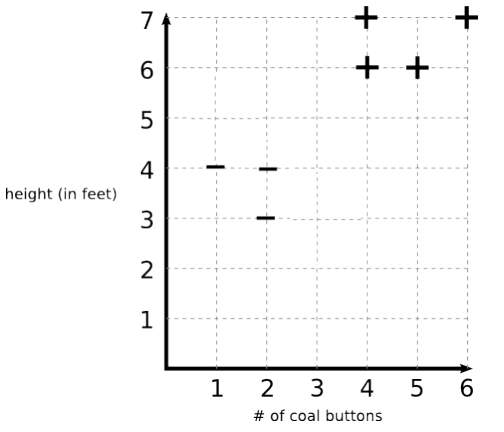

# SVM Problem: F.R.O.S.T. Magical Snowman Classification

The F.R.O.S.T. (Fictional Research On Snowman Taxonomy) scientists have collected data on magical, talking snowmen. They want to classify snowmen as **friendly (+)** or **evil (-)** based on:
- **x₁**: Number of coal buttons
- **x₂**: Height (in feet)

---

## Question A2 (10 points)

**In this SVM, what is the vector w and the constant b?**

### Solution

**Step 1: Identify the data points from the graph**

| Class | Points (buttons, height) |
|-------|-------------------------|
| Evil (−) | (1, 4), (2, 3), (2, 4) |
| Friendly (+) | (4, 6), (5, 6), (4, 7), (6, 7) |

**Step 2: Identify support vectors**

The support vectors are the closest points to the decision boundary:
- **Negative SV**: (2, 4)
- **Positive SV**: (4, 6)

**Step 3: Set up the equations**

For support vectors: $\mathbf{w} \cdot \mathbf{x} + b = \pm 1$

$$2w_1 + 4w_2 + b = -1 \quad \text{...(1) from (2,4)}$$

$$4w_1 + 6w_2 + b = +1 \quad \text{...(2) from (4,6)}$$

**Step 4: We have 2 equations but 3 unknowns — use the minimum norm condition**

Subtract equation (1) from (2):

$$2w_1 + 2w_2 = 2 \implies w_1 + w_2 = 1$$

SVM finds the **minimum $\|\mathbf{w}\|$** that satisfies the constraints. So we minimize:

$$\|\mathbf{w}\|^2 = w_1^2 + w_2^2 \quad \text{subject to} \quad w_1 + w_2 = 1$$

**Step 5: Solve the constrained optimization**

Substitute $w_2 = 1 - w_1$:

$$\|\mathbf{w}\|^2 = w_1^2 + (1 - w_1)^2 = 2w_1^2 - 2w_1 + 1$$

Take derivative and set to zero:

$$\frac{d}{dw_1}(2w_1^2 - 2w_1 + 1) = 4w_1 - 2 = 0 \implies w_1 = 0.5$$

Therefore: $w_1 = w_2 = 0.5$

**Step 6: Find b**

Substitute into equation (1):

$$2(0.5) + 4(0.5) + b = -1 \implies 1 + 2 + b = -1 \implies b = -4$$

### Answer

$$\boxed{\mathbf{w} = \begin{bmatrix} 0.5 \\ 0.5 \end{bmatrix}, \quad b = -4}$$

**Verification:**

| Point | $\mathbf{w} \cdot \mathbf{x} + b$ | Expected | ✓ |
|-------|----------------------------------|----------|---|
| (1, 4) | 0.5 + 2 − 4 = −1.5 | ≤ −1 | ✓ |
| (2, 3) | 1 + 1.5 − 4 = −1.5 | ≤ −1 | ✓ |
| (2, 4) | 1 + 2 − 4 = −1 | = −1 (SV) | ✓ |
| (4, 6) | 2 + 3 − 4 = +1 | = +1 (SV) | ✓ |
| (5, 6) | 2.5 + 3 − 4 = +1.5 | ≥ +1 | ✓ |

---

## Question A3 (10 points)

**Suppose the F.R.O.S.T. scientists discover another magical, talking snowman that is five feet tall and has six coal buttons on his chest. What would the α value of this new data point be?**

### Solution

New snowman: $\mathbf{x}_{\text{new}} = (6, 5)$ (6 buttons, 5 feet tall)

**Compute decision function:**

$$\mathbf{w} \cdot \mathbf{x}_{\text{new}} + b = 0.5(6) + 0.5(5) - 4 = 3 + 2.5 - 4 = 1.5$$

Since $1.5 > 1$, this point is **beyond the margin** (correctly classified as friendly, but not on the margin boundary).

By the **complementary slackness** condition, only points exactly on the margin ($\mathbf{w} \cdot \mathbf{x} + b = \pm 1$) have $\alpha > 0$.

### Answer

$$\boxed{\alpha = 0}$$

The new snowman is not a support vector because it lies outside the margin boundary.
